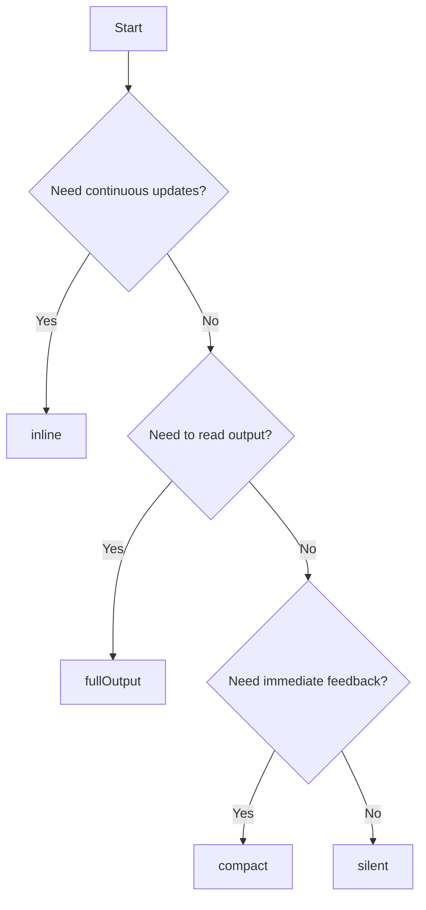

Raycast provides four output modes that determine how your script's output is displayed. Choose the mode that best fits your use case.

## Mode Overview

| Mode | Best For | Output Display |
|------|----------|----------------|
| `fullOutput` | Detailed information, terminal-like output | Separate view showing all output |
| `compact` | Quick feedback, status messages | Last line in toast notification |
| `silent` | Background tasks, minimal interruption | HUD overlay after Raycast closes |
| `inline` | Live dashboards, status monitoring | First line directly in command item |

## fullOutput Mode

Displays the entire output in a separate view, similar to a terminal window. Perfect for scripts that generate detailed output you need to read.

```bash
# @raycast.mode fullOutput
```


### Use Cases
- Translation tools
- Data conversions
- Search results
- Detailed status reports
- Any output requiring review

### Example: Translate Text

```bash
#!/bin/bash

# Required parameters:
# @raycast.schemaVersion 1
# @raycast.title Translate
# @raycast.mode fullOutput

# Optional parameters:
# @raycast.icon 📖
# @raycast.argument1 { "type": "text", "placeholder": "Word or Sentence" }
# @raycast.packageName Terminal Translate

if ! command -v tl &> /dev/null; then
	echo "trans command is required (https://github.com/ShanaMaid/terminal-translate).";
	exit 1;
fi

tl $1
```

**Source:** [translate.sh](https://github.com/raycast/script-commands/blob/master/commands/apps/terminal-translate/translate.sh)

## compact Mode

Shows the last line of standard output in a toast notification. Great for quick confirmations and status updates.

```bash
# @raycast.mode compact
```


### Use Cases
- Confirmation messages
- Simple status updates
- Quick actions with feedback
- Settings toggles

### Example: Change App Icon

```bash
#!/bin/bash

# Required parameters:
# @raycast.schemaVersion 1
# @raycast.title Change Application Icon
# @raycast.mode compact

# Optional parameters:
# @raycast.icon 🅱️
# @raycast.argument1 { "type": "text", "placeholder": "Application" }
# @raycast.packageName iconsur

# Test iconsur
t=$(which iconsur)
if [ -z "$t" ]; then
    echo "Iconsur not found, install using brew install iconsur"
    exit 1
fi

# Process application icon...
# (script logic omitted for brevity)

echo "Icon changed successfully"
```

**Source:** [iconsur.sh:9](https://github.com/raycast/script-commands/blob/master/commands/apps/iconsur/iconsur.sh#L9)

<Note>
  In compact mode, only the **last line** of output is shown. Make sure your final `echo` statement contains the message you want to display.
</Note>

## silent Mode

Displays the last line (if it exists) in an overlaying HUD toast after the Raycast window closes. Perfect for background tasks that shouldn't interrupt your workflow.

```bash
# @raycast.mode silent
```


### Use Cases
- Opening URLs or applications
- File operations
- Background processes
- Quick actions without feedback

### Example: Set Dock Position

```bash
#!/bin/bash

# Required parameters:
# @raycast.schemaVersion 1
# @raycast.title Dock Position
# @raycast.mode silent

# Optional parameters:
# @raycast.icon 🤖
# @raycast.argument1 { "type": "dropdown", "placeholder": "Position on Screen", "data": [{"title": "Left", "value": "left"}, {"title": "Right", "value": "right"}, {"title": "Bottom", "value": "bottom"}]  }
# @raycast.packageName System

defaults write com.apple.dock orientation -string $1; killall Dock
```

**Source:** [dock-set-position.sh:6](https://github.com/raycast/script-commands/blob/master/commands/system/dock-set-position.sh#L6)

### Example: Create Bear Note

```bash
#!/bin/bash

# Required parameters:
# @raycast.schemaVersion 1
# @raycast.title Add Note
# @raycast.mode silent

# Optional parameters:
# @raycast.icon images/bear-light.png
# @raycast.iconDark images/bear-dark.png
# @raycast.packageName Bear
# @raycast.argument1 { "type": "text", "placeholder": "Title", "percentEncoded": true}
# @raycast.argument2 { "type": "text", "placeholder": "Content", "optional": true, "percentEncoded": true}

open "bear://x-callback-url/create?title=${1}&text=${2}"

echo "Note created!"
```

**Source:** [bear-add-note.sh:13](https://github.com/raycast/script-commands/blob/master/commands/apps/bear/bear-add-note.sh#L13)

## inline Mode

Displays the first line of output directly in the command item. Updates automatically according to the `refreshTime` parameter. Perfect for creating live dashboards.

```bash
# @raycast.mode inline
# @raycast.refreshTime 10s
```


<Warning>
  The `refreshTime` parameter is **required** for inline mode. Without it, Raycast will use compact mode instead.
</Warning>

### Use Cases
- System monitoring (CPU, memory, disk)
- API dashboards (revenue, metrics)
- Live status displays
- Weather information
- Any real-time data

### Example: CPU Usage Monitor

```bash
#!/bin/bash

# Required parameters:
# @raycast.schemaVersion 1
# @raycast.title CPU Usage
# @raycast.mode inline
# @raycast.refreshTime 10s

# Optional parameters:
# @raycast.icon 🖥️
# @raycast.packageName System

output=$(top -l 1 | grep "CPU usage")
cpu_usage=$(echo "$output" | awk -F " " '{print $3}' | cut -d% -f1)

echo "CPU Usage: ${cpu_usage}%"
```

**Source:** [inline-cpu-usage-percent.sh:6](https://github.com/raycast/script-commands/blob/master/commands/system/inline-cpu-usage-percent.sh#L6)

### Example: Revenue Dashboard

```bash
#!/bin/bash

# Required parameters:
# @raycast.schemaVersion 1
# @raycast.title Revenue
# @raycast.mode inline
# @raycast.refreshTime 1h

# Optional parameters:
# @raycast.icon images/baremetrics.png
# @raycast.packageName Baremetrics

DATE=`gdate -d today '+%Y-%m-%d'`

# Fetch metrics from API...
# (API calls omitted for brevity)

echo "MRR: $MRR | ARR: $ARR | LTV: $LTV | ARPU: $ARPU"
```

**Source:** [simple-dashboard.sh:8-9](https://github.com/raycast/script-commands/blob/master/commands/apps/baremetrics/simple-dashboard.sh#L8-L9)

<Note>
  Press `Cmd+K` while hovering over an inline script to add it to favorites or reorder it in your root search.
</Note>

### Refresh Time Examples

```bash
# Refresh every 10 seconds (minimum)
# @raycast.refreshTime 10s

# Refresh every minute
# @raycast.refreshTime 1m

# Refresh every hour
# @raycast.refreshTime 1h

# Refresh once per day
# @raycast.refreshTime 1d
```

<Warning>
  Only the first 10 inline commands refresh automatically. Additional inline commands must be manually refreshed by navigating to them and pressing Return.
</Warning>

## ANSI Color Support

Both `fullOutput` and `inline` modes support ANSI escape codes for colorizing output. Colors automatically adapt to your appearance settings (light/dark theme).


### Supported Colors

Escape code format: `\033[<fg>;<bg>m` or `\x1b[<fg>;<bg>m`

| Color | Foreground | Background | Light Theme | Dark Theme |
|-------|------------|------------|-------------|------------|
| Black | 30 | 40 | #000000 | #000000 |
| Red | 31 | 41 | #B12424 | #FF6363 |
| Green | 32 | 42 | #006B4F | #59D499 |
| Yellow | 33 | 43 | #F8A300 | #FFC531 |
| Blue | 34 | 44 | #138AF2 | #56C2FF |
| Magenta | 35 | 45 | #9A1B6E | #CF2F98 |
| Cyan | 36 | 46 | #3EB8BF | #52EEE5 |
| White | 97 | 107 | #FFFFFF | #FFFFFF |

### Text Formatting Codes

| Code | Effect |
|------|--------|
| 0 | Reset (normal) |
| 4 | Underline |
| 9 | Crossed out |
| 24 | Not underlined |
| 29 | Not crossed out |

### Color Examples


<CodeGroup>
```bash Bash
echo -e '\033[31;42mred text on green background\033[0m'
```

```bash Bash with tput
export TERM=linux
echo "$(tput setaf 1)$(tput setab 2)red text on green background$(tput sgr0)"
```

```swift Swift
print("\u{001B}[31;42mred text on green background\u{001B}[0m")
```

```javascript JavaScript
console.log('\x1b[31;42mred text on green background\x1b[0m')
```

```applescript AppleScript
do shell script "echo '\\033[31;42mred text on green background\\033[0m'"
```
</CodeGroup>

<Note>
  Raycast also supports [8-bit](https://en.wikipedia.org/wiki/ANSI_escape_code#8-bit) and [24-bit](https://en.wikipedia.org/wiki/ANSI_escape_code#24-bit) color codes for a wider color palette. Unsupported terminal codes are stripped from output.
</Note>

## Long-Running Tasks

<Warning>
  Long-running tasks that generate partial data aren't supported in `compact`, `silent`, and `inline` modes.
</Warning>

For example, the `zip` command generates many partial logs when compressing folders. Scripts using `zip` will work in `fullOutput` but not in other modes.

**Solution:** Use quiet flags to suppress partial output:

```bash
# Won't work in compact/silent/inline modes
zip -r archive.zip folder/

# Works in all modes
zip -q -r archive.zip folder/
```

## Choosing the Right Mode

Use this decision tree to select the appropriate mode:



<CardGroup cols={2}>
  <Card title="Arguments" icon="input-text" href="/creating/arguments">
    Add custom input fields to your scripts
  </Card>
  <Card title="Metadata Reference" icon="gear" href="/creating/metadata">
    Explore all metadata parameters
  </Card>
</CardGroup>